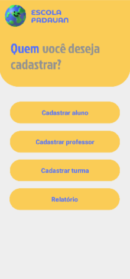
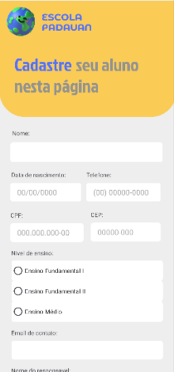
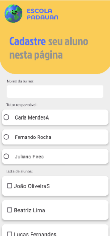
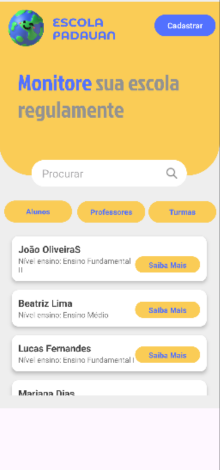
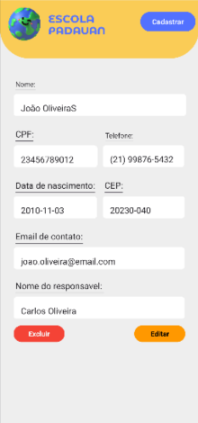

# App-Escola-Padawan---Gestao-de-Alunos_Professores_e_Turmas
# 📚 App Escola Padawan

Aplicativo Android simples para gerenciamento escolar, desenvolvido em Java com SQLite.

## ✨ Funcionalidades

- Cadastro de **alunos**
- Cadastro de **professores**
- Criação de **turmas**
- Associação de um **professor tutor** e múltiplos **alunos** por turma
- Interface com:
  - `ConstraintLayout`
  - `RecyclerView`
  - `NavigationDrawer`
- Banco de dados local com **SQLite**

## 📸 Capturas de Tela

(Adicione prints aqui depois que testar o app)

## 🛠️ Tecnologias e Componentes

- Java
- Android SDK
- SQLite (banco de dados local)
- RecyclerView (listas de alunos/professores)
- ConstraintLayout (responsividade)
- NavigationDrawer (menu lateral)

## 🖼️ Telas do Aplicativo

  
  
  
  
  

---

Desenvolvido por Geovanna dos Santos Belem 💙
